  

  

  
  

---

## 👨‍💻 About Me

I'm a **B.Tech Computer Science & Engineering graduate** and a **Full Stack Developer** focused on building scalable, reliable and user-centric web applications.

I work across the stack — from modern frontend interfaces to backend APIs, databases and AI integrations — with a focus on **clean code, performance and maintainability**.

- 🚀 Full Stack Web Development
- ⚛️ React.js · Next.js · TypeScript
- 🔧 Node.js · Express.js · REST APIs
- 🗄️ MongoDB · MySQL · SQLite
- 🤖 AI-powered applications
- 🧠 DSA & Problem Solving
- 🐳 Docker & Deployment

---

## 🛠️ Tech Stack

  

---

## 🚀 Featured Projects

<table>
<tr>

<td width="50%" valign="top">

### 🤖 Ai_Interview

AI-powered interview platform designed to help developers practice technical interviews and improve their preparation.

**Highlights**

- AI-powered interview experience
- Interview questions & evaluation
- User-friendly interface
- Real-world interview workflow

**Tech**

`JavaScript` `React` `Node.js` `AI`

</td>

<td width="50%" valign="top">

### 🔎 Perplexity

A JavaScript-based project inspired by modern AI search and information discovery experiences.

**Highlights**

- Modern search interface
- Responsive UI
- Interactive user experience
- AI-inspired application flow

**Tech**

`JavaScript` `HTML` `CSS`

</td>

</tr>

<tr>

<td width="50%" valign="top">

### 🌐 Portfolio

Personal developer portfolio showcasing projects, technical skills and professional profile.

**Highlights**

- Responsive design
- Modern developer UI
- Project showcase
- Professional presentation

**Tech**

`HTML` `CSS` `JavaScript`

</td>

<td width="50%" valign="top">

### 💡 More Projects

Explore my GitHub repositories for additional experiments, learning projects and development work.

</td>

</tr>
</table>

---

# 📊 GitHub Analytics

  

  

  

---

# 🔥 GitHub Streak

  

  <b>Consistency builds great software. 🚀</b>

---

# 📈 Contribution Activity

  

---

# 🐍 Contribution Snake

  

---

# 🎯 Current Focus

**Full Stack Engineering · Scalable Architecture · AI Applications · DSA · Open Source**

---

# 💼 Open To

**Full Stack Developer · MERN Stack Developer · React.js Developer · Software Developer**

---

# 🤝 Let's Connect

---

### ⚡ Build. Scale. Improve.

Thanks for visiting my profile.

  

